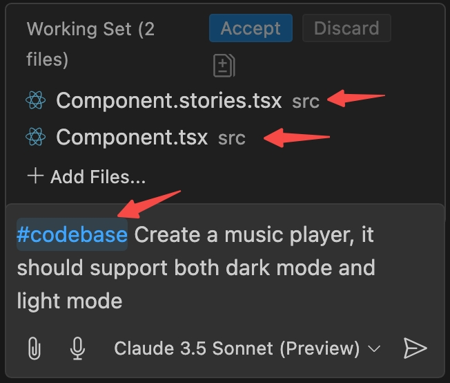

# Use Copilot like V0

Vercel's [v0.dev](https://v0.dev/) is a great tool for building web applications. However, as a VSCode/Github Copilot user, I want to use Copilot to generate code snippets like v0.dev. This project is a POC to achieve this.

To be more specific, this project is based on the following workflow:
1. Input a prompt in the Copilot chat.
2. Copilot generates a component based on the prompt.
3. Visualize the component almost immediately (This is really important for productivity!).
4. Iterate the process until the component is ready.
5. Copy-paste the component to other projects.

v0.dev can do more than this, such as complete site generation and project generation, but this project is limited to the component generation, as it is the most common use case and merely configuring a project plus writing prompts is enough to achieve this.

## Tech Stack of the Generated Component
Just like v0.dev, the generated component is based on the following tech stack:
- React
- TypeScript
- Tailwind CSS
- [shadcn](https://ui.shadcn.com/) components
- Lucide icons

I highly recommend you adapt the prompt to your own tech stack if you are not using the above tech stack, and share your repository with the community!

## Prerequisites
Ensure GitHub Copilot is installed and enabled in your editor. Make sure it supports the [.github/copilot-instructions.md](https://code.visualstudio.com/docs/copilot/copilot-customization#_use-a-githubcopilotinstructionsmd-file) file as our prompt is based on this.

## Installation

```bash
npm i
```

## Usage
1. **Start the Storybook.**
```bash
npm run sb
```
2. **Open your [Copilot Edit](https://code.visualstudio.com/docs/copilot/copilot-edits).**
3. **Add `src/Component.tsx` and `src/Component.stories.tsx` to your chat.** It will instruct Copilot to generate the component in these files. Otherwise, Copilot may not be able to generate the component in the correct files.
3. **Input your own prompt. Add `#codebase` in your prompt as this is the approach to force your editor to access all the workspace files.** If you don't add `#codebase`, Copilot may not work as expected. It seems `#codebase` is needed every time you input a message.

4. Wait for Copilot to generate results and chat iteratively to get the desired code.
5. **Save the files**, otherwise, Storybook will not update the changes.
6. **Check Storybook.**

## Synchronize with Latest Shadcn Docs and Components
To provide contexts to Copilot, we copy all the components and docs from shadcn to our workspace. When shadcn updates their components, we need to synchronize our workspace with the latest shadcn components and docs.
```bash
npm run update-shadcn
```

## Contributing

### Improve the Prompt
This repository is just a starting point and the current prompt is relatively basic, leaving substantial room for improvement. On the other hand, due to the random nature of outputs from large language models, it's difficult to definitively assess whether a pull request should be merged. If you wish to modify the prompt, I would suggest using it for a while on your own and then detailing the main improvements in your pull request.

We also welcome your suggestions on what procedures we should establish to evaluate pull requests.

### Adapt the Prompt to Your Own Tech Stack
I encourage everyone to adapt the prompt to your own tech stack and share your repository with the community! Publish your work to [this issue](#1) and I'll add it to the README when I have time.

## Other Similar Open-Source V0 Alike Projects
- [dewhale](https://github.com/Yuyz0112/dewhale) (The prompt of this project is modified from this project [here](https://github.com/Yuyz0112/dewhale/blob/main/prompts/ui-gen.md))
- [rapidpages](https://github.com/rapidpages/rapidpages)
- [openv0](https://github.com/raidendotai/openv0) (no longer maintained)